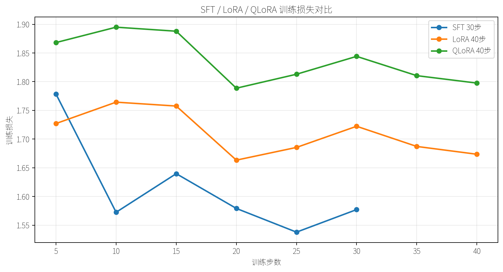
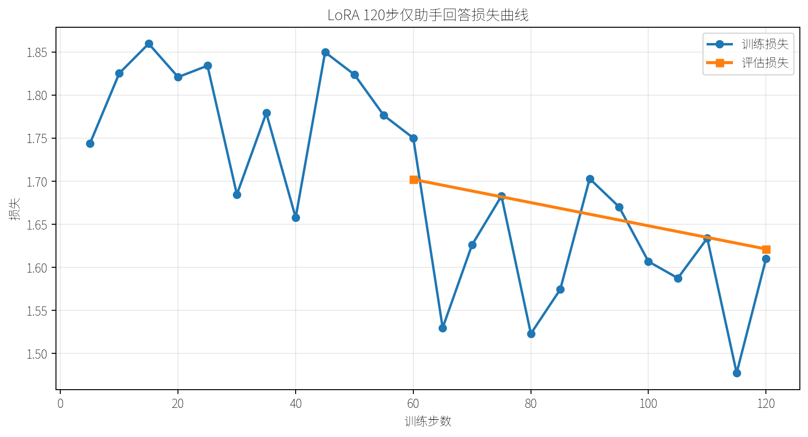
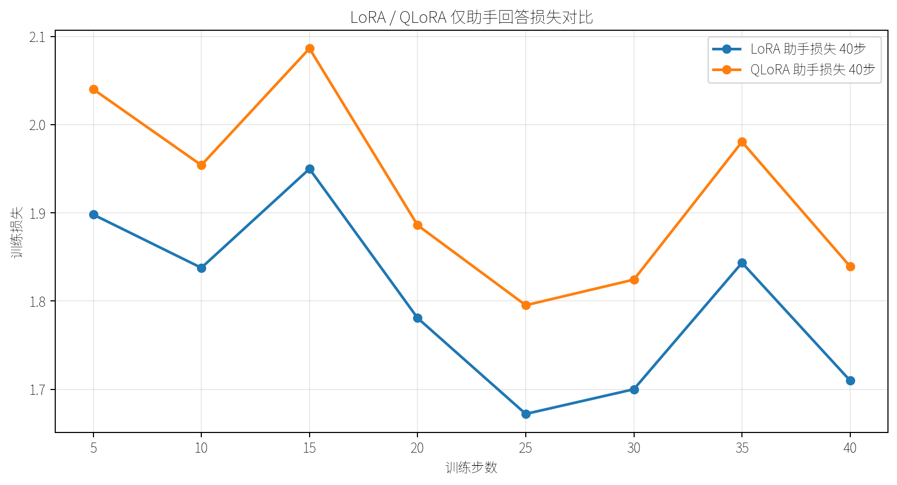
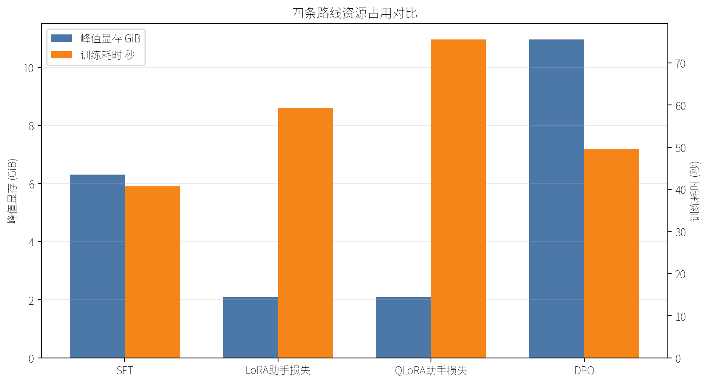

# llm-finetune-lab

这是一个围绕小规模开源大模型微调实践整理的实验仓库，目标是把 SFT、LoRA、QLoRA、DPO 这几条常见路线放到同一套可复现实验流程里比较。

项目重点不是追求大规模榜单成绩，而是关注真实训练时更容易被忽略的工程细节：数据格式、chat template、显存占用、日志记录、checkpoint 管理、训练失败排查，以及不同微调方式在单卡资源下的取舍。

## 实验路线

| 路线 | 主要库 | 目标 | 当前状态 |
| --- | --- | --- | --- |
| SFT | Transformers, TRL | 建立监督微调基线 | 已完成短训练 |
| LoRA SFT | TRL, PEFT | 验证 adapter 微调流程和存储优势 | 已完成 40 步与 120 步训练 |
| QLoRA SFT | TRL, PEFT, bitsandbytes | 验证 4-bit 加载与 adapter 训练链路 | 已完成短训练 |
| DPO | TRL, Transformers | 从 SFT checkpoint 出发验证偏好优化链路 | 已完成短训练 |
| Unsloth SFT | Unsloth, PEFT | 作为后续速度与显存对照 | 配置已预留 |

## 项目结构

```text
configs/        SFT、LoRA、QLoRA、DPO、Unsloth 的实验配置
data/           小样例数据和数据格式示例
docs/           公开学习笔记与实验复盘
reports/        训练曲线、资源对比和结果摘要
scripts/        环境检查、公开文本检查、图表生成脚本
src/            数据校验、训练入口和公共工具代码
```

## 复现

本地可以先做轻量检查：

```bash
python scripts/check_public_text.py
python scripts/check_links.py
python -m src.lab train --config configs/lora.yaml --dry-run
```

GPU 训练复现见 [复现说明](docs/reproduce.md)。

## 第一轮结果

第一批 GPU 实验在单张 RTX 5090 上完成。完整记录见 [2026-05-19 运行摘要](reports/run_summary_20260519.md)。









## 关键观察

- LoRA 和 QLoRA 都能把小规模实验的峰值显存控制在约 3 GiB，adapter 产物也明显小于完整模型 checkpoint。
- QLoRA 在这次小模型实验中没有比 LoRA 更快，说明量化带来的收益要结合模型规模和显存压力一起看。
- DPO 可以从已有 SFT checkpoint 出发跑通，但这次偏好数据是为了验证流程构造的小样本，不能直接当作质量提升结论。
- 通过注入 TRL 内置 Qwen3 训练模板后，LoRA 与 QLoRA 已能启用“仅助手回答损失”；同时发现评估集需要过滤过长样本，否则截断后可能没有可计算的 assistant token。
- 固定 prompt 的生成对比见 [生成样例对比](reports/generation_compare_20260519.md)。当前 LoRA/QLoRA 短训练更多证明链路和资源取舍，不能夸大成通用能力提升。
- Chat template 的处理细节见 [Chat Template 训练笔记](docs/chat_template_notes.md)。

## 快速检查

```bash
python -m pip install -r requirements.txt
python scripts/check_public_text.py
python scripts/check_links.py
python scripts/generate_figures.py
python scripts/summarize_runs.py --runs-dir runs_v2 --out-dir reports
python -m src.lab env
python -m src.lab train --config configs/sft.yaml --dry-run
```

GPU 训练可以通过 Accelerate 启动：

```bash
accelerate launch -m src.lab train --config configs/lora.yaml
```

## 下一步

下一步优先把远程训练脚本中已经验证过的“训练模板注入、短样本过滤、仅助手回答损失”迁回公开 `src/`，随后扩大 LoRA 和 QLoRA 的样本规模，补充更稳定的生成样例对比。
