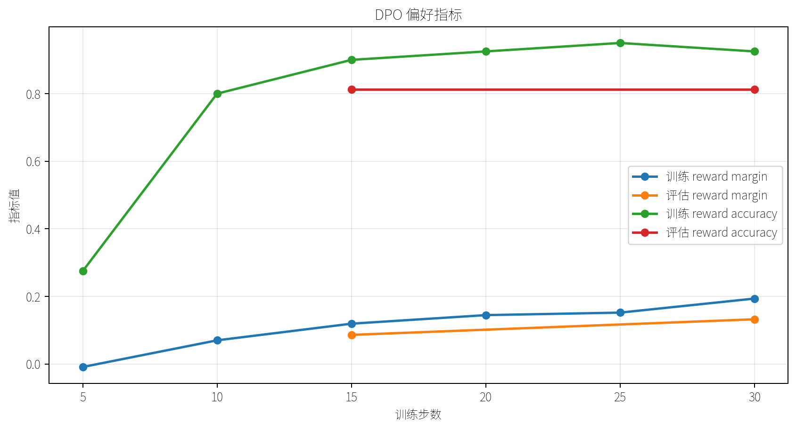

# 实验日志

这份公开日志只记录适合复盘的实验目标、配置、结果、问题和下一步。更细的机器操作记录、远程连接信息和临时排错细节保存在本地私有文件中。

## 000 - 仓库初始化

日期：2026-05-19

路线：项目基础设施

目标：建立一个干净的实验结构，用于比较 SFT、LoRA、QLoRA、DPO 和可选 Unsloth 路线。

配置：暂未训练。

硬件：本地开发机。

结果：完成公开文档边界、配置模板、训练入口骨架和公开文本检查脚本。

问题：项目需要区分公开实验记录和本地私有操作记录。

处理：将 `.local/` 加入 `.gitignore`，私有材料不进入版本控制。

下一步：在 GPU 实例上检查环境并启动小规模训练。

## 001 - 远程资产检查

日期：2026-05-19

路线：环境与资产

目标：检查 GPU 实例，并复用已有模型、数据和日志资产。

配置：暂未训练。

硬件：NVIDIA GeForce RTX 5090，32607 MiB 显存。

结果：找到本地 Qwen3-0.6B-Base checkpoint、UltraChat 200k 数据、本地 SFT checkpoint 和一组较长 SFT 训练的 TensorBoard 日志。

问题：默认 shell 中没有直接暴露 `python`。

处理：统一使用 `/root/miniconda3/bin/python` 执行远程命令。

下一步：用同一套记录方式跑 SFT、LoRA、QLoRA 和 DPO 短训练。

## 002 - Base 与 SFT 快速对比

日期：2026-05-19

路线：评估

目标：确认已有 base 与 SFT checkpoint 能正常加载，并观察行为差异。

配置：短中文提示，greedy generation。

硬件：NVIDIA GeForce RTX 5090。

结果：base 模型在 LoRA 解释提示上出现重复片段；SFT checkpoint 能输出较连贯的简短解释。

问题：第一次推理脚本把 tokenizer 返回对象直接传给 `generate`，与当前 Transformers 版本不兼容。

处理：显式取出 `input_ids` 后再生成。

下一步：把该对比作为定性 sanity check，不夸大成泛化能力结论。

## 003 - 四条路线短训练

日期：2026-05-19

路线：SFT、LoRA、QLoRA、DPO

目标：用小规模真实训练验证完整实验链路。

配置：Qwen3-0.6B-Base 或已有 SFT checkpoint，UltraChat 子集，max length 1024，bf16，gradient accumulation 8。

硬件：NVIDIA GeForce RTX 5090。

结果：

| 路线 | 步数 | 训练样本 | 评估样本 | 耗时 | 峰值显存 | 训练损失 |
| --- | ---: | ---: | ---: | ---: | ---: | ---: |
| SFT | 30 | 192 | 24 | 40.7s | 6463 MiB | 1.614 |
| LoRA | 40 | 256 | 32 | 63.3s | 3031 MiB | 1.710 |
| QLoRA | 40 | 256 | 32 | 75.8s | 3060 MiB | 1.838 |
| DPO | 30 | 128 | 16 | 49.5s | 11225 MiB | 0.641 |

问题：当前 chat template 不满足 TRL `assistant_only_loss=True` 的训练标记要求；DPOConfig 也存在版本参数差异。

处理：短训练先使用 full-token loss；DPO 去掉当前版本不支持的参数。

下一步：补齐训练兼容的 chat template，再把 assistant-only loss 作为默认设置。

## 004 - LoRA 120 步实验

日期：2026-05-19

路线：LoRA

目标：在四条路线短训练之后，跑一条更长的 adapter 实验，观察更完整的 loss 曲线和存储体积。

配置：Qwen3-0.6B-Base，UltraChat 子集，1024 条训练样本，64 条评估样本，120 steps，max length 1024，bf16，gradient accumulation 8。

硬件：NVIDIA GeForce RTX 5090。

结果：训练耗时 183.7s，峰值显存 3031 MiB，训练损失 1.741；评估损失从中段 1.707 到最终 1.680；adapter 目录约 58 MiB。

问题：该 run 仍然使用 full-token loss，因为当前 chat template 尚未兼容 assistant-only loss。

处理：在结论中显式保留这个限制，不把它包装成最终训练方案。

下一步：修正 chat template 后重复 LoRA/QLoRA，并补充生成样例对比。

## 005 - 启用仅助手回答损失

日期：2026-05-19

路线：LoRA、QLoRA

目标：让 SFT 类训练只在 assistant 回答部分计算 loss，更接近指令微调的常见做法。

配置：注入 TRL 内置 Qwen3 训练模板，启用 `assistant_only_loss`；对 UltraChat 子集先过滤较短样本，避免截断后丢失 assistant token。

硬件：NVIDIA GeForce RTX 5090。

结果：

| 路线 | 步数 | 训练样本 | 评估样本 | 耗时 | 峰值显存 | 训练损失 | 最终评估损失 |
| --- | ---: | ---: | ---: | ---: | ---: | ---: | ---: |
| LoRA | 40 | 256 | 32 | 59.4s | 2135 MiB | 1.799 | 1.838 |
| QLoRA | 40 | 256 | 32 | 75.6s | 2135 MiB | 1.926 | 1.964 |
| LoRA | 120 | 1024 | 64 | 179.9s | 2203 MiB | 1.693 | 1.621 |

问题：第一次 LoRA 仅助手回答损失 smoke test 能训练，但 eval loss 为 `nan`。

处理：检查后判断是部分评估样本过长，截断后缺少可计算的 assistant token；改为先过滤较短对话，再重新训练。

下一步：把这套模板注入和样本过滤逻辑迁回公开训练入口。

## 006 - 固定 Prompt 生成对比

日期：2026-05-19

路线：评估

目标：在 loss 和资源曲线之外，观察不同 checkpoint 的实际输出差异。

配置：三个中文 prompt，贪心解码，`max_new_tokens=160`。

硬件：NVIDIA GeForce RTX 5090。

结果：生成样例见 [生成样例对比](../reports/generation_compare_20260519.md)。

问题：短训练 adapter 在结构化 JSON 和安慰类提示上仍不稳定，部分输出有复读或特殊标记残留。

处理：公开报告中按现象记录，不把短训练结果包装成最终质量提升。

下一步：扩大样本和步数后再更新生成对比。

## 007 - 公开训练入口复现检查

日期：2026-05-19

路线：工程化整理

目标：确认远程验证过的训练逻辑已经迁回公开代码，而不是只存在临时脚本中。

配置：使用公开 `src/` 与 `configs/lora_ultrachat_assistant.yaml`，在远程新目录里改成 2 step、16 条训练样本、8 条评估样本。

硬件：NVIDIA GeForce RTX 5090。

结果：公开训练入口成功完成 2 step LoRA 训练，训练损失 1.775，说明 UltraChat 加载、短样本过滤、Qwen3 训练模板注入、仅助手回答损失和 LoRA adapter 构造都能通过公开代码执行。

问题：第一次用 PowerShell `Compress-Archive` 打包公开目录时，zip 在 Linux 解压后保留了反斜杠文件名，导致 Python 找不到 `src` 包。

处理：改用 Python `zipfile` 生成跨平台 zip，并排除 `__pycache__`。

下一步：发布前继续清理公开文件列表和 git 状态。
