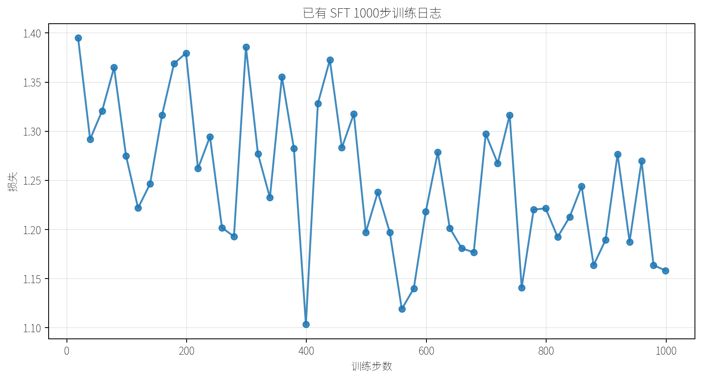

# 运行摘要 - 2026-05-19

## 环境

- GPU：NVIDIA GeForce RTX 5090，32607 MiB 显存
- Python：通过 `/root/miniconda3/bin/python` 使用 3.12.3
- 主要依赖：torch 2.8.0+cu128、transformers 5.8.1、datasets 4.8.5、trl 1.4.0、peft 0.19.1、accelerate 1.13.0
- QLoRA 补充依赖：bitsandbytes 0.49.2

## 复用资产

- Qwen3-0.6B-Base 本地 checkpoint
- UltraChat 200k 本地数据副本
- 已有 SFT checkpoint，用于定性对比和 DPO 初始化
- 已有 1000 步 SFT TensorBoard 日志

## 结果总览

| 路线 | Run ID | 步数 | 耗时 | 峰值显存 | 说明 |
| --- | --- | ---: | ---: | ---: | --- |
| SFT | `sft_20260519_103927` | 30 | 40.7s | 6463 MiB | 完整模型短训练 |
| LoRA | `lora_20260519_102936` | 40 | 63.3s | 3031 MiB | adapter 短训练 |
| QLoRA | `qlora_20260519_103425` | 40 | 75.8s | 3060 MiB | 4-bit 加载链路验证 |
| DPO | `dpo_20260519_103752` | 30 | 49.5s | 11225 MiB | 从 SFT checkpoint 验证偏好优化 |
| LoRA | `lora_20260519_104246` | 120 | 183.7s | 3031 MiB | 较长 adapter 实验，最终 eval loss 1.680 |
| LoRA | `lora_20260519_112459` | 40 | 59.4s | 2135 MiB | 启用仅助手回答损失，最终 eval loss 1.838 |
| QLoRA | `qlora_20260519_112634` | 40 | 75.6s | 2135 MiB | 启用仅助手回答损失，最终 eval loss 1.964 |
| LoRA | `lora_20260519_112838` | 120 | 179.9s | 2203 MiB | 仅助手回答损失长一点的 adapter 实验，最终 eval loss 1.621 |

## TensorBoard 曲线

### 短训练损失对比

### LoRA 120 步仅助手回答损失训练

### LoRA / QLoRA 仅助手回答损失

### DPO 偏好指标

### 资源占用

### 已有 SFT 1000 步日志

## 观察

- LoRA 和 QLoRA 在小规模实验中峰值显存都接近 3 GiB，明显低于完整 SFT 和 DPO。
- QLoRA 在这次 0.6B 模型实验中比 LoRA 慢一些，说明量化收益与模型规模、显存压力和算子开销有关。
- DPO 的 reward accuracy 和 reward margin 在短训练中有改善，但偏好数据是为验证链路构造的小样本，不能作为最终质量结论。
- LoRA 120 步实验的 adapter 目录约 58 MiB，存储优势明显。
- 注入 TRL 内置 Qwen3 训练模板后，LoRA 与 QLoRA 已经能启用仅助手回答损失。
- 第一次启用仅助手回答损失时 eval loss 出现 `nan`，原因是部分样本过长，截断后没有可计算的 assistant token；过滤较短样本后恢复正常。
- 固定 prompt 生成样例显示：SFT 与 DPO 在通用中文问答上更稳定，LoRA 对概念解释有改善，但结构化输出仍不稳定。
